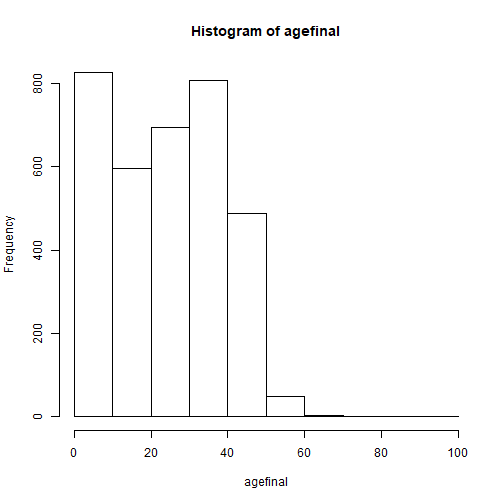
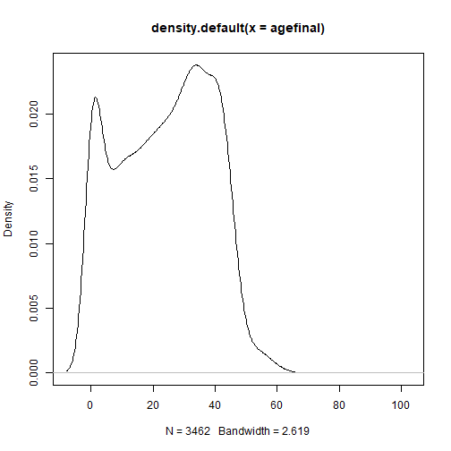

```r
setwd("~/GitHub/master/data")
library(readxl)
require(survival)
library(plyr)
require(dplyr)
require(data.table)
```

```
## Loading required package: data.table
```

```
## Warning in library(package, lib.loc = lib.loc, character.only = TRUE,
## logical.return = TRUE, : there is no package called 'data.table'
```

```r
maindata <- read_excel("maindata.xlsx", sheet = "original")
taipei <- read_excel("taipei.xlsx", sheet = "taipei")

View(maindata)
maindata1 <-as.data.table(maindata)
```

```
## Error in as.data.table(maindata): could not find function "as.data.table"
```

```r
colnames(maindata1) <- c( "city","deathnumber" , "deathyear","buildman","buildnumber","bornyear","material","area")
```

```
## Error in colnames(maindata1) <- c("city", "deathnumber", "deathyear", : object 'maindata1' not found
```

```r
maindata2 <- maindata1[,c(1,3,6,7,8)]
```

```
## Error in eval(expr, envir, enclos): object 'maindata1' not found
```

```r
X <- apply(maindata2[,c(1,4)],2,as.factor)
```

```
## Error in apply(maindata2[, c(1, 4)], 2, as.factor): object 'maindata2' not found
```

```r
deathyear <- as.numeric(maindata2$deathyear)
```

```
## Error in eval(expr, envir, enclos): object 'maindata2' not found
```

```r
dt <- data.table(X,deathyear)
```

```
## Error in data.table(X, deathyear): could not find function "data.table"
```

```r
df <- data.frame(X,deathyear)
```

```
## Error in data.frame(X, deathyear): arguments imply differing number of rows: 3462, 3466
```


```r
library(plyr)

dfcount<- dt%>% count(city, deathyear)
```

```
## Error in UseMethod("groups"): no applicable method for 'groups' applied to an object of class "function"
```

```r
apply(dfcount[,3],2,sum) #check 件數對不對
```

```
## Error in apply(dfcount[, 3], 2, sum): object 'dfcount' not found
```


```r
completeFun <- function(data, desiredCols) {
  completeVec <- complete.cases(data[, desiredCols])
  return(data[completeVec, ])
}
```


```r
library(tidyr)
library(data.table)
```

```
## Error in library(data.table): there is no package called 'data.table'
```

```r
library(plyr)
maindatause <-maindata[,c(3,6,7,8)] #留下有用的欄位
df <- maindatause
colnames(df)=c(  "deathyear","bornyear","material","area")
dfuse <- completeFun(df, "bornyear")
A <- dfuse$bornyear[1]
substring(A, 1, 3)
```

```
## [1] "075"
```

```r
bornyear <- as.numeric(substring(dfuse$bornyear, 1, 3))
deathyear <- as.numeric(   dfuse$deathyear        )
dfuse <-cbind(bornyear,deathyear,dfuse[,3],dfuse[,4])
age <- deathyear-bornyear

sort(deathyear)
```

```
##    [1]  62  63  63  63  64  70  75  77  83  83  84  84  84  84  84  85  86
##   [18]  86  87  88  88  90  91  92  92  92  92  92  92  92  92  92  92  92
##   [35]  92  93  93  93  93  93  93  93  93  93  93  93  93  93  93  93  93
##   [52]  93  93  93  93  93  93  93  93  93  93  93  94  94  94  94  94  94
##   [69]  94  94  94  94  94  94  94  94  94  94  94  94  94  94  94  94  94
##   [86]  94  94  94  94  94  94  94  94  94  94  94  94  94  94  94  94  94
##  [103]  94  94  94  94  94  94  94  94  94  94  94  94  94  94  94  94  94
##  [120]  94  94  94  94  94  94  94  94  94  94  94  94  94  94  94  94  94
##  [137]  94  94  94  94  94  94  94  94  94  94  94  94  94  94  94  94  94
##  [154]  94  95  95  95  95  95  95  95  95  95  95  95  95  95  95  95  95
##  [171]  95  95  95  95  95  95  95  95  95  95  95  95  95  95  95  95  95
##  [188]  95  95  95  95  95  95  95  95  95  95  95  95  95  95  95  95  95
##  [205]  95  95  95  95  95  95  95  95  95  95  95  95  95  95  95  95  95
##  [222]  95  95  95  95  95  95  95  95  95  95  95  95  95  95  95  95  95
##  [239]  95  95  95  95  95  95  95  95  95  95  95  95  95  95  95  95  95
##  [256]  95  95  95  95  95  95  95  95  95  95  95  95  95  95  95  95  95
##  [273]  95  95  95  95  95  95  95  95  95  95  95  95  95  95  95  95  95
##  [290]  95  95  95  95  95  95  95  95  95  95  95  95  95  95  95  95  95
##  [307]  95  95  95  95  95  95  96  96  96  96  96  96  96  96  96  96  96
##  [324]  96  96  96  96  96  96  96  96  96  96  96  96  96  96  96  96  96
##  [341]  96  96  96  96  96  96  96  96  96  96  96  96  96  96  96  96  96
##  [358]  96  96  96  96  96  96  96  96  96  96  96  96  96  96  96  96  96
##  [375]  96  96  96  96  96  96  96  96  96  96  96  96  96  96  96  96  96
##  [392]  96  96  96  96  96  96  96  96  96  96  96  96  96  96  96  96  96
##  [409]  96  96  96  96  96  96  96  96  96  96  96  96  96  96  96  96  96
##  [426]  96  96  96  96  96  96  96  96  96  96  96  96  96  96  96  96  96
##  [443]  96  96  96  96  96  96  96  96  96  96  96  96  96  96  96  96  96
##  [460]  96  96  96  96  96  96  96  96  96  96  96  96  96  96  96  96  96
##  [477]  96  96  96  96  96  96  96  96  96  96  96  96  96  96  96  97  97
##  [494]  97  97  97  97  97  97  97  97  97  97  97  97  97  97  97  97  97
##  [511]  97  97  97  97  97  97  97  97  97  97  97  97  97  97  97  97  97
##  [528]  97  97  97  97  97  97  97  97  97  97  97  97  97  97  97  97  97
##  [545]  97  97  97  97  97  97  97  97  97  97  97  97  97  97  97  97  97
##  [562]  97  97  97  97  97  97  97  97  97  97  97  97  97  97  97  97  97
##  [579]  97  97  97  97  97  97  97  97  97  97  97  97  97  97  97  97  97
##  [596]  97  97  97  97  97  97  97  97  97  97  97  97  97  97  97  97  97
##  [613]  97  97  97  97  97  97  97  97  97  97  97  97  97  97  97  97  97
##  [630]  97  97  97  97  97  97  97  97  97  97  98  98  98  98  98  98  98
##  [647]  98  98  98  98  98  98  98  98  98  98  98  98  98  98  98  98  98
##  [664]  98  98  98  98  98  98  98  98  98  98  98  98  98  98  98  98  98
##  [681]  98  98  98  98  98  98  98  98  98  98  98  98  98  98  98  98  98
##  [698]  98  98  98  98  98  98  98  98  98  98  98  98  98  98  98  98  98
##  [715]  98  98  98  98  98  98  98  98  98  98  98  98  98  98  98  98  98
##  [732]  98  98  98  98  98  98  98  98  98  98  98  98  98  98  98  98  98
##  [749]  98  98  98  98  98  98  98  98  98  98  98  98  98  98  98  98  98
##  [766]  98  98  98  98  98  98  98  98  98  98  98  98  98  98  98  98  98
##  [783]  98  98  98  98  98  98  98  98  98  99  99  99  99  99  99  99  99
##  [800]  99  99  99  99  99  99  99  99  99  99  99  99  99  99  99  99  99
##  [817]  99  99  99  99  99  99  99  99  99  99  99  99  99  99  99  99  99
##  [834]  99  99  99  99  99  99  99  99  99  99  99  99  99  99  99  99  99
##  [851]  99  99  99  99  99  99  99  99  99  99  99  99  99  99  99  99  99
##  [868]  99  99  99  99  99  99  99  99  99  99  99  99  99  99  99  99  99
##  [885]  99  99  99  99  99  99  99  99  99  99  99  99  99  99  99  99  99
##  [902]  99  99  99  99  99  99  99  99  99  99  99  99  99  99  99  99  99
##  [919]  99  99  99  99  99  99  99  99  99  99  99  99  99  99  99  99  99
##  [936]  99  99  99  99  99  99  99  99  99  99  99  99  99  99  99  99  99
##  [953]  99  99  99  99  99  99  99  99  99  99  99  99  99  99  99  99  99
##  [970]  99  99  99  99  99  99  99  99  99  99  99  99  99  99 100 100 100
##  [987] 100 100 100 100 100 100 100 100 100 100 100 100 100 100
##  [ reached getOption("max.print") -- omitted 2466 entries ]
```

```r
which(age<0)
```

```
## [1] 3313 3332 3409 3436
```

```r
dfusefinal <- dfuse[-which(age<0),]
agefinal=dfusefinal$deathyear-dfusefinal$bornyear
class(agefinal)
```

```
## [1] "numeric"
```

```r
dfusefinal <- cbind(dfusefinal,agefinal)

hist(agefinal) #畫出直方圖
```



```r
agecount <- dfusefinal %>% 
  group_by(agefinal) %>% 
  summarise(avg_count = n())  #莖葉圖


plot(density(agefinal))
```



```r
X=dfusefinal[,-5]
y=Surv(dfusefinal$agefinal)
fit <- coxph(y ~ bornyear,X ) 

summary(fit)
```

```
## Call:
## coxph(formula = y ~ bornyear, data = X)
## 
##   n= 3462, number of events= 3462 
## 
##              coef exp(coef) se(coef)     z Pr(>|z|)    
## bornyear 0.289343  1.335550 0.004305 67.21   <2e-16 ***
## ---
## Signif. codes:  0 '***' 0.001 '**' 0.01 '*' 0.05 '.' 0.1 ' ' 1
## 
##          exp(coef) exp(-coef) lower .95 upper .95
## bornyear     1.336     0.7488     1.324     1.347
## 
## Concordance= 0.919  (se = 0.001 )
## Likelihood ratio test= 8626  on 1 df,   p=<2e-16
## Wald test            = 4517  on 1 df,   p=<2e-16
## Score (logrank) test = 6370  on 1 df,   p=<2e-16
```

