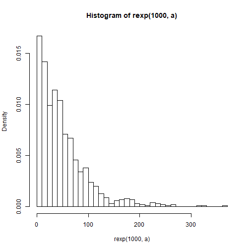
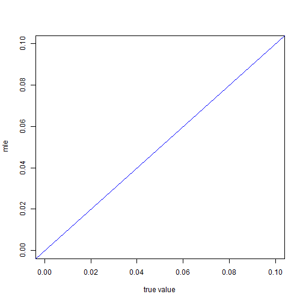
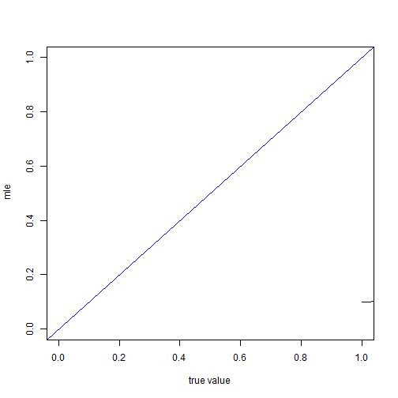

wooldridge\\

標準的right censored 和 failure time 問題

$$  t_i=min(t_i^* ,c_i   )  $$

$t_i$代表觀察到的期間\\
$t_i^*$ 代表真實存活時間\\
$c_i$  代表censored time\\

我們去建構likilihood 時應該使用$t_i$,因為這才是觀察的到的

在此處di=1 代表right censored di=0 代表 interval censored\\

站在102年的角度下

對0-5歲的樣本

$$\frac{ [ F(10)-F(0)]^{d_i}[1-F(5)]^{1-d_i} }{ 1-F(0)}$$

對5-10歲的樣本

$$\frac{ [ F(15)-F(5)]^{d_i}[1-F(10)]^{1-d_i} }{ 1-F(5)}$$

對10-15歲的樣本

$$\frac{ [ F(20)-F(10)]^{d_i}[1-F(15)]^{1-d_i} }{ 1-F(10)}$$

對15-20歲的樣本

$$\frac{ [ F(25)-F(15)]^{d_i}[1-F(20)]^{1-d_i} }{ 1-F(15)}$$

對20-25歲的樣本

$$\frac{ [ F(30)-F(20)]^{d_i}[1-F(25)]^{1-d_i} }{ 1-F(20)}$$

對25以上歲的樣本

$$\frac{ [ 1-F(25)]^{d_i}[1-F(30)]^{1-d_i} }{ 1-F(25)}$$

simulation 的設定


從民國52年開始生成資料，每年都蓋100戶房子
生到民國102年

觀察那些民國102年還健在的房子，然後去紀錄他們民國107年的情形

民國107年還健在的就是right cenosred 不在的就是interval censored

step1 先判斷房子在102年還有沒有活著

民國52年蓋的房子去扣掉50
民國53年蓋的房子去扣掉49


```r
require(maxLik)
```

```
## Loading required package: maxLik
```

```
## Warning in library(package, lib.loc = lib.loc, character.only = TRUE,
## logical.return = TRUE, : there is no package called 'maxLik'
```

```r
require(dplyr)
require(reshape2)
```

```
## Loading required package: reshape2
```

```
## 
## Attaching package: 'reshape2'
```

```
## The following object is masked from 'package:tidyr':
## 
##     smiths
```

```r
require(data.table)
```

```
## Loading required package: data.table
```

```
## Warning in library(package, lib.loc = lib.loc, character.only = TRUE,
## logical.return = TRUE, : there is no package called 'data.table'
```


```r
c2=25
c3=30
mysim3=function(lamda=0.05,n=1000){  
y=50
A <- rexp(n*y,rate = lamda)
#hist(A,probability = T,breaks =15 )
data <- matrix(A,nrow=y,ncol=n)
data102 <- matrix(0,nrow=y,ncol=n  )
for(i in 1:y){
  c=51-i
 data102[i,] <- data[i,]-c
  
}
ind<- which(data102>=0)
datanew <- matrix(0,nrow=y,ncol=n  )
data102alivelife=matrix
datanew[ind] <- data[ind]
data102alivelife <- datanew #在102年活著的樣本的壽命
#data102aliveyear <-         #在102年活著的樣本的年紀

data107 <- matrix(0,nrow=y,ncol=n  )

for(i in 1:y ){
  c=56-i
 data107[i,] <- data[i,]-c
  
}

ind2<- which(data107>=0)
datanew2 <- matrix(0,nrow=y,ncol=n  )
data107alivelife=matrix
datanew2[ind2] <- data[ind2]
data107alivelife <- datanew2

ind102<- ind
ind107<- ind2
ind_dead <- setdiff(ind,ind2) 

data102year=matrix(0,nrow=y,ncol=n  )
for(i in 1:y){
c=51-i 
for(j in 1:n)
{
if(data102alivelife[i,j]>0){
data102year[i,j]=c
}  
}
}
data107year=matrix(0,nrow=y,ncol=n  )
for(i in 1:y){
c=56-i 
for(j in 1:n)
{
if(data107alivelife[i,j]>0){
data107year[i,j]=c
}  
}
}
#data107year 為107年尚健在的建物的年齡
#data102year 為102年尚健在的建物的年齡

data107v <- data107year[which(data107year>0)]

data102v <- data102year[which(data102year>0)]


gentable=function(a){
a1<-melt(table(cut(a,breaks=seq(0,100,5) )))
a2<-data.frame(sapply(a1,function(x) gsub("\\(|\\]","",gsub("\\,","-",x))))
colnames(a2)<-c("numbers","Freq")
return(a2)  
}
data102table <- gentable(data102v)
data107talbe <- gentable(data107v)
A <- rbind(  t(data102table),t(data107talbe))
B <- A[-3,]
rownames(B)<-c("year","102","107  ")


a <- as.numeric(B[2,])
b <-as.numeric(B[3,])
c<- B[1,]

d <- rbind(  a,b   )
colnames(d) <- c
A <- d
mymle=function(param){
x<- param[ 1 ] 

a=(A[1,1]-A[2,2])*log(pexp(10,rate=x )-pexp(0,rate =x ))+A[2,2]*log(1-pexp(5,x))-A[1,1]*log(1-pexp(0,x))
b=(A[1,2]-A[2,3])*log(pexp(15,rate=x )-pexp(5,rate =x ))+A[2,3]*log(1-pexp(10,x))-A[1,2]*log(1-pexp(5,x))
c=(A[1,3]-A[2,4])*log(pexp(20,rate=x )-pexp(10,rate =x ))+A[2,4]*log(1-pexp(15,x))-A[1,3]*log(1-pexp(10,x))
d=(A[1,4]-A[2,5])*log(pexp(25,rate=x )-pexp(15,rate =x ))+A[2,5]*log(1-pexp(20,x))-A[1,4]*log(1-pexp(15,x))
e=(A[1,5]-A[2,6])*log(pexp(30,rate=x )-pexp(20,rate =x ))+A[2,6]*log(1-pexp(25,x))-A[1,5]*log(1-pexp(20,x))

f=(A[1,6]-A[2,7])*log(pexp(35,rate=x )-pexp(25,rate =x ))+A[2,7]*log(1-pexp(30,x))-A[1,6]*log(1-pexp(25,x))

g=(A[1,7]-A[2,8])*log(pexp(40,rate=x )-pexp(30,rate =x ))+A[2,8]*log(1-pexp(35,x))-A[1,7]*log(1-pexp(30,x))

h=(A[1,8]-A[2,9])*log(pexp(45,rate=x )-pexp(35,rate =x ))+A[2,9]*log(1-pexp(40,x))-A[1,8]*log(1-pexp(35,x))

i=(A[1,9]-A[2,10])*log(pexp(50,rate=x )-pexp(40,rate =x ))+A[2,10]*log(1-pexp(45,x))-A[1,9]*log(1-pexp(40,x))

j=(A[1,20]-A[2,11])*log(pexp(55,rate=x )-pexp(45,rate =x ))+A[2,11]*log(1-pexp(50,x))-A[1,10]*log(1-pexp(45,x))

return(sum(a+b+c+d+e+f+g+h+i+j))
}

mle <- maxLik( mymle, start = 0.01 )

return(mle$estimate)
}

a=0.02
mysim3( a)
```

```
## Error in maxLik(mymle, start = 0.01): could not find function "maxLik"
```

```r
mysim2(a)
```

```
## Error in mysim2(a): could not find function "mysim2"
```

```r
hist(rexp(1000,a),breaks=30,prob=T)
```



```r
A <- seq(0.01,0.1,by=0.01)
B <- NULL
for(i in 1:length(A)){
  
   B[i]<- mysim3( A[i]  )
}
```

```
## Error in maxLik(mymle, start = 0.01): could not find function "maxLik"
```

```r
plot( x=A,y=B ,xlab=" true value ",ylab=" mle" ,ylim=c(0,0.1),xlim=c(0,0.1) )
abline(0,1,col=4)
```




```r
require(maxLik)
```

```
## Loading required package: maxLik
```

```
## Warning in library(package, lib.loc = lib.loc, character.only = TRUE,
## logical.return = TRUE, : there is no package called 'maxLik'
```

```r
mysim=function(lamda=0.05){  

n=10000
y=50
A <- rexp(n*y,rate = lamda)
#hist(A,probability = T,breaks =15 )
data <- matrix(A,nrow=y,ncol=n)
data102 <- matrix(0,nrow=y,ncol=n  )
for(i in 1:y){
  c=51-i
 data102[i,] <- data[i,]-c
  
}
ind<- which(data102>=0)
datanew <- matrix(0,nrow=y,ncol=n  )
data102alivelife=matrix
datanew[ind] <- data[ind]
data102alivelife <- datanew #在102年活著的樣本的壽命
#data102aliveyear <-         #在102年活著的樣本的年紀

data107 <- matrix(0,nrow=y,ncol=n  )

for(i in 1:y ){
  c=56-i
 data107[i,] <- data[i,]-c
  
}

ind2<- which(data107>=0)
datanew2 <- matrix(0,nrow=y,ncol=n  )
data107alivelife=matrix
datanew2[ind2] <- data[ind2]
data107alivelife <- datanew2

ind102<- ind
ind107<- ind2
ind_dead <- setdiff(ind,ind2) 

data102year=matrix(0,nrow=y,ncol=n  )
for(i in 1:y){
c=51-i 
for(j in 1:n)
{
if(data102alivelife[i,j]>0){
data102year[i,j]=c
}  
}
}
data107year=matrix(0,nrow=y,ncol=n  )
for(i in 1:y){
c=56-i 
for(j in 1:n)
{
if(data107alivelife[i,j]>0){
data107year[i,j]=c
}  
}
}
#data107year 為107年尚健在的建物的年齡
#data102year 為102年尚健在的建物的年齡

data107v <- data107year[which(data107year>0)]

data102v <- data102year[which(data102year>0)]

require(dplyr)
require(reshape2)

gentable=function(a){
a1<-melt(table(cut(a,breaks=seq(0,100,5) )))
a2<-data.frame(sapply(a1,function(x) gsub("\\(|\\]","",gsub("\\,","-",x))))
colnames(a2)<-c("numbers","Freq")
return(a2)  
}
data102table <- gentable(data102v)
data107talbe <- gentable(data107v)
A <- rbind(  t(data102table),t(data107talbe))
B <- A[-3,]
rownames(B)<-c("year","102","107  ")

require(data.table)
a <- as.numeric(B[2,])
b <-as.numeric(B[3,])
c<- B[1,]

d <- data.table(cbind(  c,a,b   ))

newa <- c(  a[1:6],sum(a[7:length(a)]))
newb <- c(b[1:6],sum(b[7:length(b)]))

newd <- rbind(newa,newb)

rownames(newd) <- c("102   " ,"107" )
colnames(newd) <- c("0-5"," 5-10","10-15","15-20","20-25","25-30","30up "      )
return(newd)
}

A <- newd
```

```
## Error in eval(expr, envir, enclos): object 'newd' not found
```

```r
mymle=function(param){
x<- param[ 1 ] 
a=(A[1,1]-A[2,2])*log(pexp(10,rate=x )-pexp(0,rate =x ))+A[2,2]*log(1-pexp(5,x))-A[1,1]*log(1-pexp(0,x))
b=(A[1,2]-A[2,3])*log(pexp(15,rate=x )-pexp(5,rate =x ))+A[2,3]*log(1-pexp(10,x))-A[1,2]*log(1-pexp(5,x))
c=(A[1,3]-A[2,4])*log(pexp(20,rate=x )-pexp(10,rate =x ))+A[2,4]*log(1-pexp(15,x))-A[1,3]*log(1-pexp(10,x))
d=(A[1,4]-A[2,5])*log(pexp(25,rate=x )-pexp(15,rate =x ))+A[2,5]*log(1-pexp(20,x))-A[1,4]*log(1-pexp(15,x))
e=(A[1,5]-A[2,6])*log(pexp(30,rate=x )-pexp(20,rate =x ))+A[2,6]*log(1-pexp(25,x))-A[1,5]*log(1-pexp(20,x))
f=(A[1,6]+A[1,7]-A[2,7])*log(1-pexp(25,rate =x ))+A[2,7]*log(1-pexp(30,x))-(A[1,6]+A[1,7])*log(1-pexp(25,x))
return(sum(a+b+c+d+e+f))
}

mle <- maxLik( mymle, start = 0.1)
```

```
## Error in maxLik(mymle, start = 0.1): could not find function "maxLik"
```

```r
mle$estimate
```

```
## Error in eval(expr, envir, enclos): object 'mle' not found
```


```r
require(maxLik)
```

```
## Loading required package: maxLik
```

```
## Warning in library(package, lib.loc = lib.loc, character.only = TRUE,
## logical.return = TRUE, : there is no package called 'maxLik'
```

```r
require(dplyr)
require(reshape2)
require(data.table)
```

```
## Loading required package: data.table
```

```
## Warning in library(package, lib.loc = lib.loc, character.only = TRUE,
## logical.return = TRUE, : there is no package called 'data.table'
```


```r
c2=25
c3=30
mysim2=function(lamda=0.05,n=1000){  
y=50
A <- rexp(n*y,rate = lamda)
#hist(A,probability = T,breaks =15 )
data <- matrix(A,nrow=y,ncol=n)
data102 <- matrix(0,nrow=y,ncol=n  )
for(i in 1:y){
  c=51-i
 data102[i,] <- data[i,]-c
  
}
ind<- which(data102>=0)
datanew <- matrix(0,nrow=y,ncol=n  )
data102alivelife=matrix
datanew[ind] <- data[ind]
data102alivelife <- datanew #在102年活著的樣本的壽命
#data102aliveyear <-         #在102年活著的樣本的年紀

data107 <- matrix(0,nrow=y,ncol=n  )

for(i in 1:y ){
  c=56-i
 data107[i,] <- data[i,]-c
  
}

ind2<- which(data107>=0)
datanew2 <- matrix(0,nrow=y,ncol=n  )
data107alivelife=matrix
datanew2[ind2] <- data[ind2]
data107alivelife <- datanew2

ind102<- ind
ind107<- ind2
ind_dead <- setdiff(ind,ind2) 

data102year=matrix(0,nrow=y,ncol=n  )
for(i in 1:y){
c=51-i 
for(j in 1:n)
{
if(data102alivelife[i,j]>0){
data102year[i,j]=c
}  
}
}
data107year=matrix(0,nrow=y,ncol=n  )
for(i in 1:y){
c=56-i 
for(j in 1:n)
{
if(data107alivelife[i,j]>0){
data107year[i,j]=c
}  
}
}
#data107year 為107年尚健在的建物的年齡
#data102year 為102年尚健在的建物的年齡

data107v <- data107year[which(data107year>0)]

data102v <- data102year[which(data102year>0)]


gentable=function(a){
a1<-melt(table(cut(a,breaks=seq(0,100,5) )))
a2<-data.frame(sapply(a1,function(x) gsub("\\(|\\]","",gsub("\\,","-",x))))
colnames(a2)<-c("numbers","Freq")
return(a2)  
}
data102table <- gentable(data102v)
data107talbe <- gentable(data107v)
A <- rbind(  t(data102table),t(data107talbe))
B <- A[-3,]
rownames(B)<-c("year","102","107  ")


a <- as.numeric(B[2,])
b <-as.numeric(B[3,])
c<- B[1,]

d <- data.table(cbind(  c,a,b   ))

newa <- c(  a[1:6],sum(a[7:length(a)]))
newb <- c(b[1:6],sum(b[7:length(b)]))

newd <- rbind(newa,newb)

rownames(newd) <- c("102   " ,"107" )
colnames(newd) <- c("0-5"," 5-10","10-15","15-20","20-25","25-30","30up "      )
A <- newd
mymle=function(param){
x<- param[ 1 ] 
a=(A[1,1]-A[2,2])*log(pexp(10,rate=x )-pexp(0,rate =x ))+A[2,2]*log(1-pexp(5,x))-A[1,1]*log(1-pexp(0,x))
b=(A[1,2]-A[2,3])*log(pexp(15,rate=x )-pexp(5,rate =x ))+A[2,3]*log(1-pexp(10,x))-A[1,2]*log(1-pexp(5,x))
c=(A[1,3]-A[2,4])*log(pexp(20,rate=x )-pexp(10,rate =x ))+A[2,4]*log(1-pexp(15,x))-A[1,3]*log(1-pexp(10,x))
d=(A[1,4]-A[2,5])*log(pexp(25,rate=x )-pexp(15,rate =x ))+A[2,5]*log(1-pexp(20,x))-A[1,4]*log(1-pexp(15,x))
e=(A[1,5]-A[2,6])*log(pexp(30,rate=x )-pexp(20,rate =x ))+A[2,6]*log(1-pexp(25,x))-A[1,5]*log(1-pexp(20,x))

f=(A[1,6]+A[1,7]-A[2,7])*log(1-pexp(c2,rate =x ))+A[2,7]*log(1-pexp(c3,x))-(A[1,6]+A[1,7])*log(1-pexp(25,x))
return(sum(a+b+c+d+e+f))
}

mle <- maxLik( mymle, start = 0.1 )

return(mle$estimate)
}
#pexp(50,rate =x )
mysim2(0.1,1000)
```

```
## Error in data.table(cbind(c, a, b)): could not find function "data.table"
```

```r
mysim2(0.05,10000)
```

```
## Error in data.table(cbind(c, a, b)): could not find function "data.table"
```

```r
mysim2(0.05,1000)
```

```
## Error in data.table(cbind(c, a, b)): could not find function "data.table"
```

```r
mysim2(0.05,100)
```

```
## Error in data.table(cbind(c, a, b)): could not find function "data.table"
```

```r
mysim2(0.04,100)
```

```
## Error in data.table(cbind(c, a, b)): could not find function "data.table"
```

```r
mysim2(0.03,10)
```

```
## Error in data.table(cbind(c, a, b)): could not find function "data.table"
```

```r
mysim2(0.02)
```

```
## Error in data.table(cbind(c, a, b)): could not find function "data.table"
```

```r
mysim2(0.1)
```

```
## Error in data.table(cbind(c, a, b)): could not find function "data.table"
```

```r
#sample <- replicate(10,mysim2(0.03))
```


```r
c(mean(sample)-1.96*sd(sample),mean(sample)+1.96*sd(sample))
```

```
## Warning in mean.default(sample): argument is not numeric or logical:
## returning NA
```

```
## Error in as.double(x): cannot coerce type 'closure' to vector of type 'double'
```

```r
A <- seq(0.01,0.1,by=0.01)
B <- NULL
for(i in 1:length(A)){
  
   B[i]<- mysim2( A[i]  )
}
```

```
## Error in data.table(cbind(c, a, b)): could not find function "data.table"
```

```r
plot( x=A,y=B,type="l" ,xlab=" true value ",ylab=" mle" ,ylim=c(0,0.1),xlim=c(0,0.1) )
abline(0,1,col=4)
```


```r
A <- seq(0.1,1,by=0.05)
B <- NULL
for(i in 1:length(A)){
  
   B[i]<- mysim2( A[i]  )
}
```

```
## Error in data.table(cbind(c, a, b)): could not find function "data.table"
```

```r
plot( x=A,y=B,type="l" ,xlab=" true value ",ylab=" mle" ,ylim=c(0,1),xlim=c(0,1) )
abline(0,1,col=4)
```




