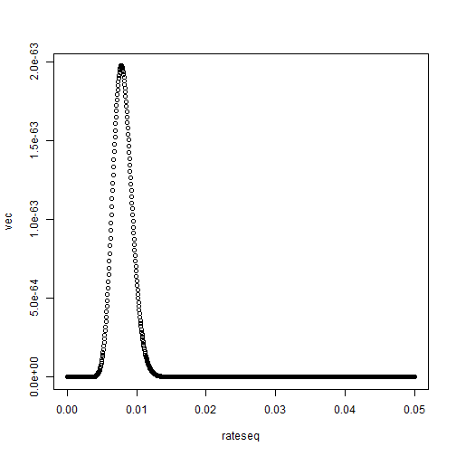

wooldridge\\

標準的right censored 和 failure time 問題

$$  t_i=min(t_i^* ,c_i   )  $$

$t_i$代表觀察到的期間\\
$t_i^*$ 代表真實存活時間\\
$c_i$  代表censored time\\

我們去建構likilihood 時應該使用$t_i$,因為這才是觀察的到的


$$  \sum_{i=1}^n \Bigl\{   d_i log[f(t_i|x_i;\theta) +(1-d_i)log[1-F(t_i|x_i;\theta)]-log[1-F(b-a_i|x_i;\theta)]      \Bigr\} $$

in my opinion\\

$$  \prod_{i \in R}(  1-F_i(C_r|x_i;\theta)) \prod_{i \in I}\Bigl\{ 
( 1-F_i(L_i|x_i;\theta))-(  1-F_i(R_i|x_i;\theta))  \Bigr\} $$


在此處di=1 代表right censored di=0 代表 interval censored\\


$$    \sum_{i=1}^n   \Bigl\{d_i log( 1-F_i(C_i|x_i;\theta) )+          (1-d_i) log \bigl\{ F_i(R_i|x_i;\theta)-F_i(L_i|x_i;\theta)   \bigr\}  \Bigr\}               $$

simulation 的設定


基本的case 服從指數分配 且 只有 right censored 和 failure time 完整的case


```r
lamda <-0.03
n <- 1000

sample <- rexp(n,lamda)
censortime <- runif(n,0,10)
y=pmin(sample,censortime   )

censored<- I(sample>censortime)
uncensored <- I(sample<censortime)
right <- y[censored]

failure <- y[uncensored]
(n-length(right))/sum( y )
```

[1] 0.02918146

```r
prod( dexp(failure,rate=0.3)  )*prod(  exp(-0.3*right))
```

[1] 0

```r
prod( dexp(failure,rate=9)  )*prod(  exp(-9*right))
```

[1] 0

```r
m <- 1000

vec <- numeric(m)
rateseq <- seq( 0.01,1,length=m   )
for(i in 1:m){
  
 vec[i] <-  prod( dexp(failure,rate=rateseq[i])  )*prod(  exp(-rateseq[i]*right))
  
  
}
rateseq[which.max(vec)]
```

[1] 0.02882883

```r
f2 <- function(x){prod( dexp(failure,rate=x))*prod(  exp(-x*right))}

maxfunction=function(m,func){
  
vec <- numeric(m)
rateseq <- seq( 0,1,length=m   )
for(i in 1:m){
  
 vec[i] <-  func(    rateseq[i])
  
  
}
return(rateseq[which.max(vec)])
  
  
}

maxfunction(  m=100000,f2  )
```

[1] 0.02918029


```r
f2 <- function(x){prod( dexp(failure,rate=x))*prod(  exp(-x*right))}

f3 <- function(x){-( prod( dexp(failure,rate=x)  )*prod(exp(-x*right) ) )}
optimise(f2,c(0,1),maximum = T)
```

```
## $maximum
## [1] 0.9999339
## 
## $objective
## [1] 0
```

```r
f2(0.025)
```

```
## [1] 2.764058e-263
```

```r
f2(0.019)
```

```
## [1] 2.924346e-267
```

```r
f2(0.016)
```

```
## [1] 3.005345e-271
```

```r
f2(0.02)
```

```
## [1] 2.814558e-266
```

```r
f2(1)
```

```
## [1] 0
```

```r
nlm(  f3,c(-1,1)     )
```

```
## Warning in dexp(failure, rate = x): NaNs produced
```

```
## Warning in -x * right: longer object length is not a multiple of shorter
## object length
```

```
## Warning in dexp(failure, rate = x): NaNs produced
```

```
## Warning in -x * right: longer object length is not a multiple of shorter
## object length
```

```
## Warning in nlm(f3, c(-1, 1)): NA/Inf replaced by maximum positive value
```

```
## Warning in dexp(failure, rate = x): NaNs produced
```

```
## Warning in -x * right: longer object length is not a multiple of shorter
## object length
```

```
## Warning in nlm(f3, c(-1, 1)): NA/Inf replaced by maximum positive value
```

```
## Warning in dexp(failure, rate = x): NaNs produced
```

```
## Warning in -x * right: longer object length is not a multiple of shorter
## object length
```

```
## Warning in nlm(f3, c(-1, 1)): NA/Inf replaced by maximum positive value
```

```
## $minimum
## [1] 1.797693e+308
## 
## $estimate
## [1] -1  1
## 
## $gradient
## [1] 0 0
## 
## $code
## [1] 1
## 
## $iterations
## [1] 0
```


```r
cutpoint1 <- c(5,10,15,20,25)
cutpoint2 <- c(10,15,20,25,100)
i<- y[uncensored]

a <- i[5<i & i <10]
b <- i[ 10<i & i <15]
c <- i[ 15<i & i <20]
d <- i[ 20<i & i <25]
e <- i[  25<i & i <2000  ]

length(a)
```

```
## [1] 34
```

```r
length(b)
```

```
## [1] 0
```

```r
A <- list(a,b,c,d,e)

lapply(A, length)
```

```
## [[1]]
## [1] 34
## 
## [[2]]
## [1] 0
## 
## [[3]]
## [1] 0
## 
## [[4]]
## [1] 0
## 
## [[5]]
## [1] 0
```

```r
aa <- rep(5,length(a))
aaa <- rep(10,length(a))
IL <-rep(  cutpoint1,lapply(A, length)   )
IR <-rep(  cutpoint2,lapply(A, length)   )

f <- function(x){ (x*sum(-right))+sum( log( exp(-IL*x)-exp(-IR*x) ) ) }
optimise(f,c(-1,1),maximum = T)
```

```
## Warning in log(exp(-IL * x) - exp(-IR * x)): NaNs produced
```

```
## Warning in optimise(f, c(-1, 1), maximum = T): NA/Inf replaced by maximum
## positive value
```

```
## Warning in log(exp(-IL * x) - exp(-IR * x)): NaNs produced
```

```
## Warning in optimise(f, c(-1, 1), maximum = T): NA/Inf replaced by maximum
## positive value
```

```
## Warning in log(exp(-IL * x) - exp(-IR * x)): NaNs produced
```

```
## Warning in optimise(f, c(-1, 1), maximum = T): NA/Inf replaced by maximum
## positive value
```

```
## $maximum
## [1] 0.007777127
## 
## $objective
## [1] -144.3822
```

```r
#改用prod的方式來做
f4 <- function(x){prod( exp(-x*right) )*prod( exp( -x*IL)-exp(-x*IR  )       ) }
optimise(f4,c(-1,1),maximum = T)
```

```
## Warning in optimise(f4, c(-1, 1), maximum = T): NA/Inf replaced by maximum
## positive value
```

```
## $maximum
## [1] 0.2361341
## 
## $objective
## [1] 0
```

```r
m <- 1000
vec <- numeric(m)
rateseq <- seq( 0.00,0.05,length=m )
for(i in 1:m){
  
 vec[i] <-  f4(rateseq[i])
  
  
}

plot( rateseq  ,  vec   ) 
```



```r
rateseq[which.max(vec)]
```

```
## [1] 0.007757758
```

```r
f4(0.002828283   )
```

```
## [1] 5.621257e-69
```

```r
f4(0.016)
```

```
## [1] 2.222526e-68
```

```r
f4(0.02)
```

```
## [1] 1.131005e-72
```

```r
f4(0.03)
```

```
## [1] 1.180081e-85
```

```r
f4(0.0058)
```

```
## [1] 5.197206e-64
```


1.碩陳寧哭
