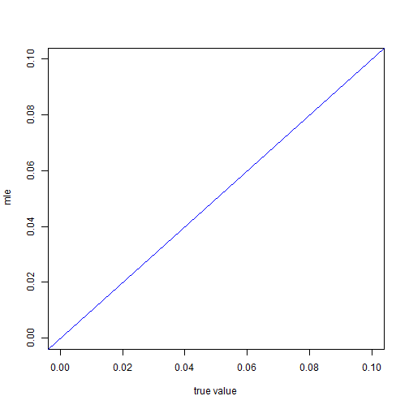
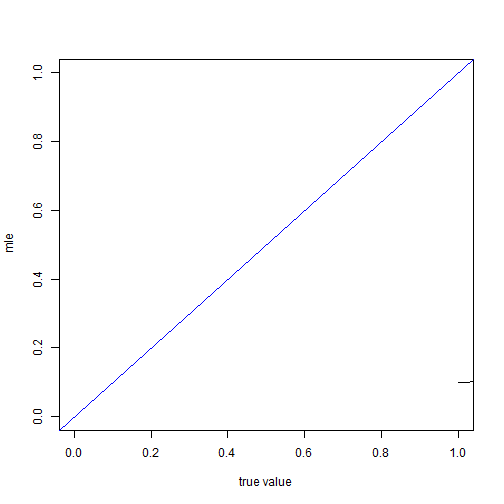

wooldridge\\

標準的right censored 和 failure time 問題

$$  t_i=min(t_i^* ,c_i   )  $$

$t_i$代表觀察到的期間\\
$t_i^*$ 代表真實存活時間\\
$c_i$  代表censored time\\

我們去建構likilihood 時應該使用$t_i$,因為這才是觀察的到的

在此處di=1 代表right censored di=0 代表 interval censored\\

站在102年的角度下

對0-5歲的樣本

$$\frac{ [ F(10)-F(0)]^{d_i}[1-F(5)]^{1-d_i} }{ 1-F(0)}$$

對5-10歲的樣本

$$\frac{ [ F(15)-F(5)]^{d_i}[1-F(10)]^{1-d_i} }{ 1-F(5)}$$

對10-15歲的樣本

$$\frac{ [ F(20)-F(10)]^{d_i}[1-F(15)]^{1-d_i} }{ 1-F(10)}$$

對15-20歲的樣本

$$\frac{ [ F(25)-F(15)]^{d_i}[1-F(20)]^{1-d_i} }{ 1-F(15)}$$

對20-25歲的樣本

$$\frac{ [ F(30)-F(20)]^{d_i}[1-F(25)]^{1-d_i} }{ 1-F(20)}$$

對25以上歲的樣本

$$\frac{ [ 1-F(25)]^{d_i}[1-F(30)]^{1-d_i} }{ 1-F(25)}$$

simulation 的設定


從民國52年開始生成資料，每年都蓋100戶房子
生到民國102年

觀察那些民國102年還健在的房子，然後去紀錄他們民國107年的情形

民國107年還健在的就是right cenosred 不在的就是interval censored

step1 先判斷房子在102年還有沒有活著

民國52年蓋的房子去扣掉50
民國53年蓋的房子去扣掉49


```r
require(maxLik)
```

```
## Loading required package: maxLik
```

```
## Warning in library(package, lib.loc = lib.loc, character.only = TRUE,
## logical.return = TRUE, : there is no package called 'maxLik'
```

```r
require(dplyr)
require(reshape2)
require(data.table)
```

```
## Loading required package: data.table
```

```
## Warning in library(package, lib.loc = lib.loc, character.only = TRUE,
## logical.return = TRUE, : there is no package called 'data.table'
```


```r
mysim1=function(lamda=0.05,n=1000){  
y=50
A <- rexp(n*y,rate = lamda)
#hist(A,probability = T,breaks =15 )
data <- matrix(A,nrow=y,ncol=n)
data102 <- matrix(0,nrow=y,ncol=n  )
for(i in 1:y){
  c=51-i
 data102[i,] <- data[i,]-c
  
}
ind<- which(data102>=0)
datanew <- matrix(0,nrow=y,ncol=n  )
data102alivelife=matrix
datanew[ind] <- data[ind]
data102alivelife <- datanew #在102年活著的樣本的壽命
#data102aliveyear <-         #在102年活著的樣本的年紀

data107 <- matrix(0,nrow=y,ncol=n  )

for(i in 1:y ){
  c=56-i
 data107[i,] <- data[i,]-c
  
}

ind2<- which(data107>=0)
datanew2 <- matrix(0,nrow=y,ncol=n  )
data107alivelife=matrix
datanew2[ind2] <- data[ind2]
data107alivelife <- datanew2

ind102<- ind
ind107<- ind2
ind_dead <- setdiff(ind,ind2) 

data102year=matrix(0,nrow=y,ncol=n  )
for(i in 1:y){
c=51-i 
for(j in 1:n)
{
if(data102alivelife[i,j]>0){
data102year[i,j]=c
}  
}
}
data107year=matrix(0,nrow=y,ncol=n  )
for(i in 1:y){
c=56-i 
for(j in 1:n)
{
if(data107alivelife[i,j]>0){
data107year[i,j]=c
}  
}
}
#data107year 為107年尚健在的建物的年齡
#data102year 為102年尚健在的建物的年齡

data107v <- data107year[which(data107year>0)]

data102v <- data102year[which(data102year>0)]


gentable=function(a){
a1<-melt(table(cut(a,breaks=seq(0,100,5) )))
a2<-data.frame(sapply(a1,function(x) gsub("\\(|\\]","",gsub("\\,","-",x))))
colnames(a2)<-c("numbers","Freq")
return(a2)  
}
data102table <- gentable(data102v)
data107talbe <- gentable(data107v)
A <- rbind(  t(data102table),t(data107talbe))
B <- A[-3,]
rownames(B)<-c("year","102","107  ")


a <- as.numeric(B[2,])
b <-as.numeric(B[3,])
c<- B[1,]

d <- rbind(  a,b   )
colnames(d) <- c
A <- d
mymle=function(param){
x<- param[ 1 ] 

a=(A[1,1]-A[2,2])*log(pexp(10,rate=x )-pexp(0,rate =x ))+A[2,2]*log(1-pexp(5,x))-A[1,1]*log(1-pexp(0,x))
b=(A[1,2]-A[2,3])*log(pexp(15,rate=x )-pexp(5,rate =x ))+A[2,3]*log(1-pexp(10,x))-A[1,2]*log(1-pexp(5,x))
c=(A[1,3]-A[2,4])*log(pexp(20,rate=x )-pexp(10,rate =x ))+A[2,4]*log(1-pexp(15,x))-A[1,3]*log(1-pexp(10,x))
d=(A[1,4]-A[2,5])*log(pexp(25,rate=x )-pexp(15,rate =x ))+A[2,5]*log(1-pexp(20,x))-A[1,4]*log(1-pexp(15,x))
e=(A[1,5]-A[2,6])*log(pexp(30,rate=x )-pexp(20,rate =x ))+A[2,6]*log(1-pexp(25,x))-A[1,5]*log(1-pexp(20,x))

f=(A[1,6]-A[2,7])*log(pexp(35,rate=x )-pexp(25,rate =x ))+A[2,7]*log(1-pexp(30,x))-A[1,6]*log(1-pexp(25,x))

g=(A[1,7]-A[2,8])*log(pexp(40,rate=x )-pexp(30,rate =x ))+A[2,8]*log(1-pexp(35,x))-A[1,7]*log(1-pexp(30,x))

h=(A[1,8]-A[2,9])*log(pexp(45,rate=x )-pexp(35,rate =x ))+A[2,9]*log(1-pexp(40,x))-A[1,8]*log(1-pexp(35,x))

i=(A[1,9]-A[2,10])*log(pexp(50,rate=x )-pexp(40,rate =x ))+A[2,10]*log(1-pexp(45,x))-A[1,9]*log(1-pexp(40,x))

j=(A[1,20]-A[2,11])*log(pexp(55,rate=x )-pexp(45,rate =x ))+A[2,11]*log(1-pexp(50,x))-A[1,10]*log(1-pexp(45,x))

return(sum(a+b+c+d+e+f+g+h+i+j))
}

mle <- maxLik( mymle, start = 0.011 )

return(mle$estimate)
}
```


```r
require(maxLik)
```

```
## Loading required package: maxLik
```

```
## Warning in library(package, lib.loc = lib.loc, character.only = TRUE,
## logical.return = TRUE, : there is no package called 'maxLik'
```

```r
require(dplyr)
require(reshape2)
require(data.table)
```

```
## Loading required package: data.table
```

```
## Warning in library(package, lib.loc = lib.loc, character.only = TRUE,
## logical.return = TRUE, : there is no package called 'data.table'
```


```r
c2=25
c3=30
mysim2=function(lamda=0.05,n=1000){  
y=50
A <- rexp(n*y,rate = lamda)
#hist(A,probability = T,breaks =15 )
data <- matrix(A,nrow=y,ncol=n)
data102 <- matrix(0,nrow=y,ncol=n  )
for(i in 1:y){
  c=51-i
 data102[i,] <- data[i,]-c
  
}
ind<- which(data102>=0)
datanew <- matrix(0,nrow=y,ncol=n  )
data102alivelife=matrix
datanew[ind] <- data[ind]
data102alivelife <- datanew #在102年活著的樣本的壽命
#data102aliveyear <-         #在102年活著的樣本的年紀

data107 <- matrix(0,nrow=y,ncol=n  )

for(i in 1:y ){
  c=56-i
 data107[i,] <- data[i,]-c
  
}

ind2<- which(data107>=0)
datanew2 <- matrix(0,nrow=y,ncol=n  )
data107alivelife=matrix
datanew2[ind2] <- data[ind2]
data107alivelife <- datanew2

ind102<- ind
ind107<- ind2
ind_dead <- setdiff(ind,ind2) 

data102year=matrix(0,nrow=y,ncol=n  )
for(i in 1:y){
c=51-i 
for(j in 1:n)
{
if(data102alivelife[i,j]>0){
data102year[i,j]=c
}  
}
}
data107year=matrix(0,nrow=y,ncol=n  )
for(i in 1:y){
c=56-i 
for(j in 1:n)
{
if(data107alivelife[i,j]>0){
data107year[i,j]=c
}  
}
}
#data107year 為107年尚健在的建物的年齡
#data102year 為102年尚健在的建物的年齡

data107v <- data107year[which(data107year>0)]

data102v <- data102year[which(data102year>0)]


gentable=function(a){
a1<-melt(table(cut(a,breaks=seq(0,100,5) )))
a2<-data.frame(sapply(a1,function(x) gsub("\\(|\\]","",gsub("\\,","-",x))))
colnames(a2)<-c("numbers","Freq")
return(a2)  
}
data102table <- gentable(data102v)
data107talbe <- gentable(data107v)
A <- rbind(  t(data102table),t(data107talbe))
B <- A[-3,]
rownames(B)<-c("year","102","107  ")


a <- as.numeric(B[2,])
b <-as.numeric(B[3,])
c<- B[1,]

d <- data.table(cbind(  c,a,b   ))

newa <- c(  a[1:6],sum(a[7:length(a)]))
newb <- c(b[1:6],sum(b[7:length(b)]))

newd <- rbind(newa,newb)

rownames(newd) <- c("102   " ,"107" )
colnames(newd) <- c("0-5"," 5-10","10-15","15-20","20-25","25-30","30up "      )
A <- newd
mymle=function(param){
x<- param[ 1 ] 
a=(A[1,1]-A[2,2])*log(pexp(10,rate=x )-pexp(0,rate =x ))+A[2,2]*log(1-pexp(5,x))-A[1,1]*log(1-pexp(0,x))
b=(A[1,2]-A[2,3])*log(pexp(15,rate=x )-pexp(5,rate =x ))+A[2,3]*log(1-pexp(10,x))-A[1,2]*log(1-pexp(5,x))
c=(A[1,3]-A[2,4])*log(pexp(20,rate=x )-pexp(10,rate =x ))+A[2,4]*log(1-pexp(15,x))-A[1,3]*log(1-pexp(10,x))
d=(A[1,4]-A[2,5])*log(pexp(25,rate=x )-pexp(15,rate =x ))+A[2,5]*log(1-pexp(20,x))-A[1,4]*log(1-pexp(15,x))
e=(A[1,5]-A[2,6])*log(pexp(30,rate=x )-pexp(20,rate =x ))+A[2,6]*log(1-pexp(25,x))-A[1,5]*log(1-pexp(20,x))

f=(A[1,6]+A[1,7]-A[2,7])*log(1-pexp(c2,rate =x ))+A[2,7]*log(1-pexp(c3,x))-(A[1,6]+A[1,7])*log(1-pexp(25,x))
return(sum(a+b+c+d+e+f))
}

mle <- maxLik( mymle, start = 0.011 )

return(mle$estimate)
}

#pexp(50,rate =x )

#sample <- replicate(10,mysim2(0.03))
```


```r
bias=function( x,true){
  
  mean(x)-true
}

mse=function(x,true){
  
  mean(   (x-rep(true,length(x)))^2  )
  
}
mse(  c(6,7,8) ,3)
```

```
## [1] 16.66667
```

```r
9+16+25/3
```

```
## [1] 33.33333
```


```r
total=function( x,true ){
  
  c(bias(x,true),mse(x,true)    )
  
}
```


```r
m1_0.02 <- replicate(2000,mysim1(lamda = 0.02))
```

```
## Error in maxLik(mymle, start = 0.011): could not find function "maxLik"
```

```r
m2_0.02 <- replicate(2000,mysim2(lamda = 0.02))
```

```
## Error in data.table(cbind(c, a, b)): could not find function "data.table"
```

```r
m1_0.03 <- replicate(2000,mysim1(lamda = 0.03))
```

```
## Error in maxLik(mymle, start = 0.011): could not find function "maxLik"
```

```r
m2_0.03 <- replicate(2000,mysim2(lamda = 0.03))
```

```
## Error in data.table(cbind(c, a, b)): could not find function "data.table"
```

```r
m1_0.04 <- replicate(2000,mysim1(lamda = 0.04))
```

```
## Error in maxLik(mymle, start = 0.011): could not find function "maxLik"
```

```r
m2_0.04 <- replicate(2000,mysim2(lamda = 0.04))
```

```
## Error in data.table(cbind(c, a, b)): could not find function "data.table"
```

```r
m1_0.05 <- replicate(2000,mysim1(lamda = 0.05))
```

```
## Error in maxLik(mymle, start = 0.011): could not find function "maxLik"
```

```r
m2_0.05 <- replicate(2000,mysim2(lamda = 0.05))
```

```
## Error in data.table(cbind(c, a, b)): could not find function "data.table"
```

```r
m1_0.06 <- replicate(2000,mysim1(lamda = 0.06))
```

```
## Error in maxLik(mymle, start = 0.011): could not find function "maxLik"
```

```r
m2_0.06 <- replicate(2000,mysim2(lamda = 0.06))
```

```
## Error in data.table(cbind(c, a, b)): could not find function "data.table"
```

```r
m1_0.07 <- replicate(2000,mysim1(lamda = 0.07))
```

```
## Error in maxLik(mymle, start = 0.011): could not find function "maxLik"
```

```r
m2_0.07 <- replicate(2000,mysim2(lamda = 0.07))
```

```
## Error in data.table(cbind(c, a, b)): could not find function "data.table"
```

```r
m1_0.08 <- replicate(2000,mysim1(lamda = 0.08))
```

```
## Error in maxLik(mymle, start = 0.011): could not find function "maxLik"
```

```r
m2_0.08 <- replicate(2000,mysim2(lamda = 0.08))
```

```
## Error in data.table(cbind(c, a, b)): could not find function "data.table"
```

```r
m1_0.09 <- replicate(2000,mysim1(lamda = 0.09))
```

```
## Error in maxLik(mymle, start = 0.011): could not find function "maxLik"
```

```r
m2_0.09 <- replicate(2000,mysim2(lamda = 0.09))
```

```
## Error in data.table(cbind(c, a, b)): could not find function "data.table"
```

```r
m1_0.10 <- replicate(2000,mysim1(lamda = 0.10))
```

```
## Error in maxLik(mymle, start = 0.011): could not find function "maxLik"
```

```r
m2_0.10 <- replicate(2000,mysim2(lamda = 0.10))
```

```
## Error in data.table(cbind(c, a, b)): could not find function "data.table"
```


```r
options(scipen=999)
ans2 <- matrix( c(
total(m2_0.02,0.02),
total(m2_0.03,0.03),
total(m2_0.04,0.04),
total(m2_0.05,0.05),
total(m2_0.06,0.06),
total(m2_0.07,0.07),
total(m2_0.08,0.08),
total(m2_0.09,0.09),
total(m2_0.10,0.10) )
,ncol=2,nrow=9,byrow=T
)
```

```
## Error in mean(x): object 'm2_0.02' not found
```

```r
colnames(ans2) <- c( " bias " ,"mse"   )
```

```
## Error in colnames(ans2) <- c(" bias ", "mse"): object 'ans2' not found
```

```r
rownames(ans2) <- seq(0.02,0.1,by=0.01)
```

```
## Error in rownames(ans2) <- seq(0.02, 0.1, by = 0.01): object 'ans2' not found
```


```r
ans1 <- matrix( c(
  total(m1_0.02,0.02),
  total(m1_0.03,0.03),
  total(m1_0.04,0.04),
  total(m1_0.05,0.05),
  total(m1_0.06,0.06),
  total(m1_0.07,0.07),
  total(m1_0.08,0.08),
  total(m1_0.09,0.09),
  total(m1_0.10,0.10) )
  ,ncol=2,nrow=9,byrow=T
)
```

```
## Error in mean(x): object 'm1_0.02' not found
```

```r
colnames(ans1) <- c( " bias " ,"mse"   )
```

```
## Error in colnames(ans1) <- c(" bias ", "mse"): object 'ans1' not found
```

```r
rownames(ans1) <- seq(0.02,0.1,by=0.01)
```

```
## Error in rownames(ans1) <- seq(0.02, 0.1, by = 0.01): object 'ans1' not found
```

```r
mybig1=function(lamda){
replicate(2000,mysim1(lamda,n = 1000))
}

mybig2=function(lamda){
replicate(2000,mysim1(lamda,n = 2000))
}

mybig3=function(lamda){
replicate(2000,mysim1(lamda,n = 3000))
}

mybig4=function(lamda){
replicate(2000,mysim1(lamda,n = 4000))
}

mybig5=function(lamda){
replicate(2000,mysim1(lamda,n = 5000))
}

seq <- seq(0.02,0.1,by=0.01)
seqlist <- list( 0.02,0.03,0.04,0.05,0.06,0.07,0.08,0.09,0.1)

#lapply(list(0.02,0.03,0.05), mysim1)#先lapply 在replicate

N1000 <- lapply(seqlist,mybig1)
```

```
## Error in maxLik(mymle, start = 0.011): could not find function "maxLik"
```

```r
N2000 <- lapply(seqlist,mybig2)
```

```
## Error in maxLik(mymle, start = 0.011): could not find function "maxLik"
```

```r
N3000 <- lapply(seqlist,mybig3)
```

```
## Error in maxLik(mymle, start = 0.011): could not find function "maxLik"
```

```r
N4000 <- lapply(seqlist,mybig4)
```

```
## Error in maxLik(mymle, start = 0.011): could not find function "maxLik"
```

```r
N5000 <- lapply(seqlist,mybig5)
```

```
## Error in maxLik(mymle, start = 0.011): could not find function "maxLik"
```

```r
mybigm1 <- list(N1000,N2000,N3000,N4000,N5000)
```

```
## Error in eval(expr, envir, enclos): object 'N1000' not found
```

```r
aa <- mapply( total,N1000, seqlist    )
```

```
## Error in mapply(total, N1000, seqlist): object 'N1000' not found
```

```r
bb <- mapply( total,N2000, seqlist    )
```

```
## Error in mapply(total, N2000, seqlist): object 'N2000' not found
```

```r
t(aa)
```

```
##      [,1] [,2] [,3] [,4] [,5] [,6] [,7] [,8] [,9] [,10] [,11] [,12] [,13]
## [1,]    5    5    5    5    5    5    5    5    5     5     5     5     5
##      [,14] [,15] [,16] [,17] [,18] [,19] [,20] [,21] [,22] [,23] [,24]
## [1,]     5     5     5     5     5     5     5     5     5     5     5
##      [,25] [,26] [,27] [,28] [,29] [,30] [,31] [,32] [,33] [,34]
## [1,]     5     5     5     5     5     5     5     5     5     5
```

```r
t(bb)
```

```
## Error in t(bb): object 'bb' not found
```

```r
N <- c(1000,2000,3000,4000,5000,6000,7000,8000,9000)

aaa <- matrix(mapply(mysim1,seq,rep(N,9)),ncol=9,nrow=9,byrow=F)
```

```
## Error in maxLik(mymle, start = 0.011): could not find function "maxLik"
```


```r
A <- seq(0.01,0.1,by=0.01)
B <- NULL
for(i in 1:length(A)){
  
   B[i]<- mysim1( A[i]  )
}
```

```
## Error in maxLik(mymle, start = 0.011): could not find function "maxLik"
```

```r
plot( x=A,y=B ,xlab=" true value ",ylab=" mle" ,ylim=c(0,0.1),xlim=c(0,0.1) )
abline(0,1,col=4)
```




```r
c(mean(sample)-1.96*sd(sample),mean(sample)+1.96*sd(sample))
```

```
## [1] -33.14665  99.33948
```

```r
A <- seq(0.01,0.1,by=0.01)
B <- NULL
for(i in 1:length(A)){
  
   B[i]<- mysim2( A[i]  )
}
```

```
## Error in data.table(cbind(c, a, b)): could not find function "data.table"
```

```r
plot( x=A,y=B,type="l" ,xlab=" true value ",ylab=" mle" ,ylim=c(0,0.1),xlim=c(0,0.1) )
abline(0,1,col=4)
```


```r
A <- seq(0.1,1,by=0.05)
B <- NULL
for(i in 1:length(A)){
  
   B[i]<- mysim2( A[i]  )
}
```

```
## Error in data.table(cbind(c, a, b)): could not find function "data.table"
```

```r
plot( x=A,y=B,type="l" ,xlab=" true value ",ylab=" mle" ,ylim=c(0,1),xlim=c(0,1) )
abline(0,1,col=4)
```



