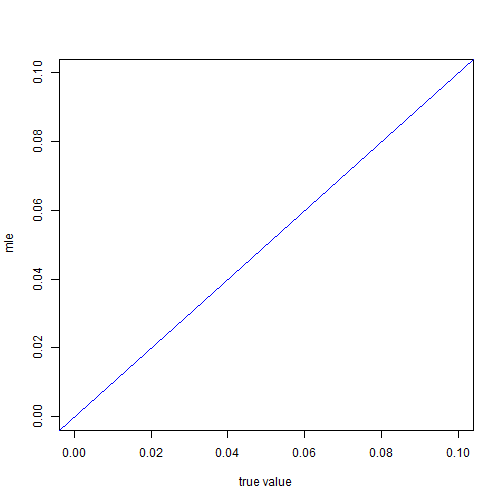
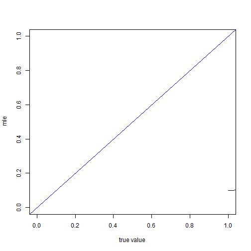

wooldridge\\

標準的right censored 和 failure time 問題

$$  t_i=min(t_i^* ,c_i   )  $$

$t_i$代表觀察到的期間\\
$t_i^*$ 代表真實存活時間\\
$c_i$  代表censored time\\

我們去建構likilihood 時應該使用$t_i$,因為這才是觀察的到的

在此處di=1 代表right censored di=0 代表 interval censored\\

站在102年的角度下

對0-5歲的樣本

$$\frac{ [ F(10)-F(0)]^{d_i}[1-F(5)]^{1-d_i} }{ 1-F(0)}$$

對5-10歲的樣本

$$\frac{ [ F(15)-F(5)]^{d_i}[1-F(10)]^{1-d_i} }{ 1-F(5)}$$

對10-15歲的樣本

$$\frac{ [ F(20)-F(10)]^{d_i}[1-F(15)]^{1-d_i} }{ 1-F(10)}$$

對15-20歲的樣本

$$\frac{ [ F(25)-F(15)]^{d_i}[1-F(20)]^{1-d_i} }{ 1-F(15)}$$

對20-25歲的樣本

$$\frac{ [ F(30)-F(20)]^{d_i}[1-F(25)]^{1-d_i} }{ 1-F(20)}$$

對25以上歲的樣本

$$\frac{ [ 1-F(25)]^{d_i}[1-F(30)]^{1-d_i} }{ 1-F(25)}$$

simulation 的設定


從民國52年開始生成資料，每年都蓋100戶房子
生到民國102年

觀察那些民國102年還健在的房子，然後去紀錄他們民國107年的情形

民國107年還健在的就是right cenosred 不在的就是interval censored

step1 先判斷房子在102年還有沒有活著

民國52年蓋的房子去扣掉50
民國53年蓋的房子去扣掉49


```r
require(maxLik)
```

```
## Loading required package: maxLik
```

```
## Warning in library(package, lib.loc = lib.loc, character.only = TRUE,
## logical.return = TRUE, : there is no package called 'maxLik'
```

```r
require(dplyr)
require(reshape2)
require(data.table)
```

```
## Loading required package: data.table
```

```
## Warning in library(package, lib.loc = lib.loc, character.only = TRUE,
## logical.return = TRUE, : there is no package called 'data.table'
```

```r
require(maxLik)
```

```
## Loading required package: maxLik
```

```
## Warning in library(package, lib.loc = lib.loc, character.only = TRUE,
## logical.return = TRUE, : there is no package called 'maxLik'
```

```r
require(dplyr)
require(reshape2)
require(data.table)
```

```
## Loading required package: data.table
```

```
## Warning in library(package, lib.loc = lib.loc, character.only = TRUE,
## logical.return = TRUE, : there is no package called 'data.table'
```

```r
library(parallel)
cpu.cores <- detectCores()
cl <- makeCluster(cpu.cores)
options(scipen=999,digits = 9)
```


```r
mysim1=function(lamda=0.05,n=1000){  
y=50
AC <- rexp(n*y,rate = lamda)
#hist(A,probability = T,breaks =15 )
data <- matrix(AC,nrow=y,ncol=n)
data102 <- matrix(0,nrow=y,ncol=n  )
for(i in 1:y){
  c=51-i
 data102[i,] <- data[i,]-c
  
}
ind<- which(data102>=0)
datanew <- matrix(0,nrow=y,ncol=n  )
data102alivelife=matrix
datanew[ind] <- data[ind]
data102alivelife <- datanew #在102年活著的樣本的壽命
#data102aliveyear <-         #在102年活著的樣本的年紀

data107 <- matrix(0,nrow=y,ncol=n  )

for(i in 1:y ){
  c=56-i
 data107[i,] <- data[i,]-c
  
}

ind2<- which(data107>=0)
datanew2 <- matrix(0,nrow=y,ncol=n  )
data107alivelife=matrix
datanew2[ind2] <- data[ind2]
data107alivelife <- datanew2

ind102<- ind
ind107<- ind2
ind_dead <- setdiff(ind,ind2) 

data102year=matrix(0,nrow=y,ncol=n  )
for(i in 1:y){
c=51-i 
for(j in 1:n)
{
if(data102alivelife[i,j]>0){
data102year[i,j]=c
}  
}
}
data107year=matrix(0,nrow=y,ncol=n  )
for(i in 1:y){
c=56-i 
for(j in 1:n)
{
if(data107alivelife[i,j]>0){
data107year[i,j]=c
}  
}
}
#data107year 為107年尚健在的建物的年齡
#data102year 為102年尚健在的建物的年齡

data107v <- data107year[which(data107year>0)]

data102v <- data102year[which(data102year>0)]


gentable=function(a){
a1<-melt(table(cut(a,breaks=seq(0,100,5) )))
a2<-data.frame(sapply(a1,function(x) gsub("\\(|\\]","",gsub("\\,","-",x))))
colnames(a2)<-c("numbers","Freq")
return(a2)  
}
data102table <- gentable(data102v)
data107talbe <- gentable(data107v)
A <- rbind(  t(data102table),t(data107talbe))
B <- A[-3,]
rownames(B)<-c("year","102","107  ")

a <- as.numeric(B[2,])
b <-as.numeric(B[3,])
c<- B[1,]

d <- rbind(  a,b   )
colnames(d) <- c
A <- d
mymle=function(par){
x<- par[ 1 ] 

a=(A[1,1]-A[2,2])*log(pexp(10,rate=x )-pexp(0,rate =x ))+A[2,2]*log(1-pexp(5,x))-A[1,1]*log(1-pexp(0,x))
b=(A[1,2]-A[2,3])*log(pexp(15,rate=x )-pexp(5,rate =x ))+A[2,3]*log(1-pexp(10,x))-A[1,2]*log(1-pexp(5,x))
c=(A[1,3]-A[2,4])*log(pexp(20,rate=x )-pexp(10,rate =x ))+A[2,4]*log(1-pexp(15,x))-A[1,3]*log(1-pexp(10,x))
d=(A[1,4]-A[2,5])*log(pexp(25,rate=x )-pexp(15,rate =x ))+A[2,5]*log(1-pexp(20,x))-A[1,4]*log(1-pexp(15,x))
e=(A[1,5]-A[2,6])*log(pexp(30,rate=x )-pexp(20,rate =x ))+A[2,6]*log(1-pexp(25,x))-A[1,5]*log(1-pexp(20,x))
f=(A[1,6]-A[2,7])*log(pexp(35,rate=x )-pexp(25,rate =x ))+A[2,7]*log(1-pexp(30,x))-A[1,6]*log(1-pexp(25,x))

g=(A[1,7]-A[2,8])*log(pexp(40,rate=x )-pexp(30,rate =x ))+A[2,8]*log(1-pexp(35,x))-A[1,7]*log(1-pexp(30,x))

h=(A[1,8]-A[2,9])*log(pexp(45,rate=x )-pexp(35,rate =x ))+A[2,9]*log(1-pexp(40,x))-A[1,8]*log(1-pexp(35,x))

i=(A[1,9]-A[2,10])*log(pexp(50,rate=x )-pexp(40,rate =x ))+A[2,10]*log(1-pexp(45,x))-A[1,9]*log(1-pexp(40,x))

j=(A[1,20]-A[2,11])*log(pexp(55,rate=x )-pexp(45,rate =x ))+A[2,11]*log(1-pexp(50,x))-A[1,10]*log(1-pexp(45,x))

return(sum(a+b+c+d+e+f+g+h+i+j))
}
mymle2=function(par){
x<- par[ 1 ] 

a=(A[1,1]-A[2,2])*log(pexp(10,rate=x )-pexp(0,rate =x ))+A[2,2]*log(1-pexp(5,x))-A[1,1]*log(1-pexp(0,x))
b=(A[1,2]-A[2,3])*log(pexp(15,rate=x )-pexp(5,rate =x ))+A[2,3]*log(1-pexp(10,x))-A[1,2]*log(1-pexp(5,x))
c=(A[1,3]-A[2,4])*log(pexp(20,rate=x )-pexp(10,rate =x ))+A[2,4]*log(1-pexp(15,x))-A[1,3]*log(1-pexp(10,x))
d=(A[1,4]-A[2,5])*log(pexp(25,rate=x )-pexp(15,rate =x ))+A[2,5]*log(1-pexp(20,x))-A[1,4]*log(1-pexp(15,x))
e=(A[1,5]-A[2,6])*log(pexp(30,rate=x )-pexp(20,rate =x ))+A[2,6]*log(1-pexp(25,x))-A[1,5]*log(1-pexp(20,x))
f=(A[1,6]-A[2,7])*log(pexp(35,rate=x )-pexp(25,rate =x ))+A[2,7]*log(1-pexp(30,x))-A[1,6]*log(1-pexp(25,x))

g=(A[1,7]-A[2,8])*log(pexp(40,rate=x )-pexp(30,rate =x ))+A[2,8]*log(1-pexp(35,x))-A[1,7]*log(1-pexp(30,x))

h=(A[1,8]-A[2,9])*log(pexp(45,rate=x )-pexp(35,rate =x ))+A[2,9]*log(1-pexp(40,x))-A[1,8]*log(1-pexp(35,x))

i=(A[1,9]-A[2,10])*log(pexp(50,rate=x )-pexp(40,rate =x ))+A[2,10]*log(1-pexp(45,x))-A[1,9]*log(1-pexp(40,x))

j=(A[1,20]-A[2,11])*log(pexp(55,rate=x )-pexp(45,rate =x ))+A[2,11]*log(1-pexp(50,x))-A[1,10]*log(1-pexp(45,x))

return(-sum(a+b+c+d+e+f+g+h+i+j))
}

mle <- maxLik( mymle, start = 0.011 )
mle2 <- optim( 0.011, fn = mymle2)
return(mle2$par)
}

mle$estimate
```

```
## Error in eval(expr, envir, enclos): object 'mle' not found
```

```r
mle2$par
```

```
## Error in eval(expr, envir, enclos): object 'mle2' not found
```


```r
c2=25
c3=30
mysim2=function(lamda=0.05,n=1000){  
y=50
A <- rexp(n*y,rate = lamda)
#hist(A,probability = T,breaks =15 )
data <- matrix(A,nrow=y,ncol=n)
data102 <- matrix(0,nrow=y,ncol=n  )
for(i in 1:y){
  c=51-i
 data102[i,] <- data[i,]-c
  
}
ind<- which(data102>=0)
datanew <- matrix(0,nrow=y,ncol=n  )
data102alivelife=matrix
datanew[ind] <- data[ind]
data102alivelife <- datanew #在102年活著的樣本的壽命
#data102aliveyear <-         #在102年活著的樣本的年紀

data107 <- matrix(0,nrow=y,ncol=n  )

for(i in 1:y ){
  c=56-i
 data107[i,] <- data[i,]-c
  
}

ind2<- which(data107>=0)
datanew2 <- matrix(0,nrow=y,ncol=n  )
data107alivelife=matrix
datanew2[ind2] <- data[ind2]
data107alivelife <- datanew2

ind102<- ind
ind107<- ind2
ind_dead <- setdiff(ind,ind2) 

data102year=matrix(0,nrow=y,ncol=n  )
for(i in 1:y){
c=51-i 
for(j in 1:n)
{
if(data102alivelife[i,j]>0){
data102year[i,j]=c
}  
}
}
data107year=matrix(0,nrow=y,ncol=n  )
for(i in 1:y){
c=56-i 
for(j in 1:n)
{
if(data107alivelife[i,j]>0){
data107year[i,j]=c
}  
}
}
#data107year 為107年尚健在的建物的年齡
#data102year 為102年尚健在的建物的年齡

data107v <- data107year[which(data107year>0)]

data102v <- data102year[which(data102year>0)]


gentable=function(a){
a1<-melt(table(cut(a,breaks=seq(0,100,5) )))
a2<-data.frame(sapply(a1,function(x) gsub("\\(|\\]","",gsub("\\,","-",x))))
colnames(a2)<-c("numbers","Freq")
return(a2)  
}
data102table <- gentable(data102v)
data107talbe <- gentable(data107v)
A <- rbind(  t(data102table),t(data107talbe))
B <- A[-3,]
rownames(B)<-c("year","102","107  ")


a <- as.numeric(B[2,])
b <-as.numeric(B[3,])
c<- B[1,]

d <- data.table(cbind(  c,a,b   ))

newa <- c(  a[1:6],sum(a[7:length(a)]))
newb <- c(b[1:6],sum(b[7:length(b)]))

newd <- rbind(newa,newb)

rownames(newd) <- c("102   " ,"107" )
colnames(newd) <- c("0-5"," 5-10","10-15","15-20","20-25","25-30","30up "      )
A <- newd
mymle=function(param){
x<- param[ 1 ] 
a=(A[1,1]-A[2,2])*log(pexp(10,rate=x )-pexp(0,rate =x ))+A[2,2]*log(1-pexp(5,x))-A[1,1]*log(1-pexp(0,x))
b=(A[1,2]-A[2,3])*log(pexp(15,rate=x )-pexp(5,rate =x ))+A[2,3]*log(1-pexp(10,x))-A[1,2]*log(1-pexp(5,x))
c=(A[1,3]-A[2,4])*log(pexp(20,rate=x )-pexp(10,rate =x ))+A[2,4]*log(1-pexp(15,x))-A[1,3]*log(1-pexp(10,x))
d=(A[1,4]-A[2,5])*log(pexp(25,rate=x )-pexp(15,rate =x ))+A[2,5]*log(1-pexp(20,x))-A[1,4]*log(1-pexp(15,x))
e=(A[1,5]-A[2,6])*log(pexp(30,rate=x )-pexp(20,rate =x ))+A[2,6]*log(1-pexp(25,x))-A[1,5]*log(1-pexp(20,x))

f=(A[1,6]+A[1,7]-A[2,7])*log(1-pexp(c2,rate =x ))+A[2,7]*log(1-pexp(c3,x))-(A[1,6]+A[1,7])*log(1-pexp(25,x))
return(sum(a+b+c+d+e+f))
}

mle <- maxLik( mymle, start = 0.011 )

return(mle$estimate)
}

#pexp(50,rate =x )

#sample <- replicate(10,mysim2(0.03))
```


```r
bias=function( x,true){
  
  mean(x)-true
}

mse=function(x,true){
  
  mean(   (x-rep(true,length(x)))^2  )
  
}
mse(  c(6,7,8) ,3)
```

```
## [1] 16.6666667
```

```r
9+16+25/3
```

```
## [1] 33.3333333
```


```r
total=function( x,true ){
  
  c(bias(x,true),mse(x,true)    )
}
```


```r
options(scipen=999)

msebig=function(z){
seq <- seq(0.02,0.1,by=0.01)

B=matrix(0,nrow=length(z),ncol=length(z[[1]]))
for(i in  1 : 9 ){
  for(j in 1:5 ){
    B[i,j]  <- mse(  z[[i]][[j]],seq[i]  )
  }
}
xx <- t(B)
xx <- as.matrix(xx)
rownames(xx) <- c("1000","2000","3000","4000","5000")
colnames(xx) <- seq(0.02,0.1,by=0.01)
return(xx)
}

biasbig=function(z){
seq <- seq(0.02,0.1,by=0.01)
B=matrix(0,nrow=length(z),ncol=length(z[[1]]))
for(i in  1 : 9 ){
  for(j in 1:5 ){
    B[i,j]  <- bias(  z[[i]][[j]],seq[i]  )
  }
}
xx <- t(B)
xx <- as.matrix(xx)
rownames(xx) <- c("1000","2000","3000","4000","5000")
colnames(xx) <- seq(0.02,0.1,by=0.01)
return(xx)
}
```


```r
mybig_m1=function( lamda  ){

require(maxLik)
require(dplyr)
require(data.table)

mysim1=function(lamda,n){  
y=50
A <- rexp(n*y,rate = lamda)
#hist(A,probability = T,breaks =15 )
data <- matrix(A,nrow=y,ncol=n)
data102 <- matrix(0,nrow=y,ncol=n  )
for(i in 1:y){
  c=51-i
 data102[i,] <- data[i,]-c
  
}
ind<- which(data102>=0)
datanew <- matrix(0,nrow=y,ncol=n  )
data102alivelife=matrix
datanew[ind] <- data[ind]
data102alivelife <- datanew #在102年活著的樣本的壽命
#data102aliveyear <-         #在102年活著的樣本的年紀

data107 <- matrix(0,nrow=y,ncol=n  )

for(i in 1:y ){
  c=56-i
 data107[i,] <- data[i,]-c
  
}

ind2<- which(data107>=0)
datanew2 <- matrix(0,nrow=y,ncol=n  )
data107alivelife=matrix
datanew2[ind2] <- data[ind2]
data107alivelife <- datanew2

ind102<- ind
ind107<- ind2
ind_dead <- setdiff(ind,ind2) 

data102year=matrix(0,nrow=y,ncol=n  )
for(i in 1:y){
c=51-i 
for(j in 1:n)
{
if(data102alivelife[i,j]>0){
data102year[i,j]=c
}  
}
}
data107year=matrix(0,nrow=y,ncol=n  )
for(i in 1:y){
c=56-i 
for(j in 1:n)
{
if(data107alivelife[i,j]>0){
data107year[i,j]=c
}  
}
}
#data107year 為107年尚健在的建物的年齡
#data102year 為102年尚健在的建物的年齡

data107v <- data107year[which(data107year>0)]

data102v <- data102year[which(data102year>0)]


gentable=function(a){
a1<-melt(table(cut(a,breaks=seq(0,100,5) )))
a2<-data.frame(sapply(a1,function(x) gsub("\\(|\\]","",gsub("\\,","-",x))))
colnames(a2)<-c("numbers","Freq")
return(a2)  
}
data102table <- gentable(data102v)
data107talbe <- gentable(data107v)
A <- rbind(  t(data102table),t(data107talbe))
B <- A[-3,]
rownames(B)<-c("year","102","107  ")

a <- as.numeric(B[2,])
b <-as.numeric(B[3,])
c<- B[1,]

d <- rbind(  a,b   )
colnames(d) <- c
A <- d
mymle=function(param){
x<- param[ 1 ] 

a=(A[1,1]-A[2,2])*log(pexp(10,rate=x )-pexp(0,rate =x ))+A[2,2]*log(1-pexp(5,x))-A[1,1]*log(1-pexp(0,x))
b=(A[1,2]-A[2,3])*log(pexp(15,rate=x )-pexp(5,rate =x ))+A[2,3]*log(1-pexp(10,x))-A[1,2]*log(1-pexp(5,x))
c=(A[1,3]-A[2,4])*log(pexp(20,rate=x )-pexp(10,rate =x ))+A[2,4]*log(1-pexp(15,x))-A[1,3]*log(1-pexp(10,x))
d=(A[1,4]-A[2,5])*log(pexp(25,rate=x )-pexp(15,rate =x ))+A[2,5]*log(1-pexp(20,x))-A[1,4]*log(1-pexp(15,x))
e=(A[1,5]-A[2,6])*log(pexp(30,rate=x )-pexp(20,rate =x ))+A[2,6]*log(1-pexp(25,x))-A[1,5]*log(1-pexp(20,x))
f=(A[1,6]-A[2,7])*log(pexp(35,rate=x )-pexp(25,rate =x ))+A[2,7]*log(1-pexp(30,x))-A[1,6]*log(1-pexp(25,x))

g=(A[1,7]-A[2,8])*log(pexp(40,rate=x )-pexp(30,rate =x ))+A[2,8]*log(1-pexp(35,x))-A[1,7]*log(1-pexp(30,x))

h=(A[1,8]-A[2,9])*log(pexp(45,rate=x )-pexp(35,rate =x ))+A[2,9]*log(1-pexp(40,x))-A[1,8]*log(1-pexp(35,x))

i=(A[1,9]-A[2,10])*log(pexp(50,rate=x )-pexp(40,rate =x ))+A[2,10]*log(1-pexp(45,x))-A[1,9]*log(1-pexp(40,x))

j=(A[1,20]-A[2,11])*log(pexp(55,rate=x )-pexp(45,rate =x ))+A[2,11]*log(1-pexp(50,x))-A[1,10]*log(1-pexp(45,x))

return(-sum(a+b+c+d+e+f+g+h+i+j))
}

mle <- optim( 0.011,mymle  )

return(mle$par)
}
  
R=2000
mybig1=function(lamda){
a <- replicate(R,mysim1(lamda,n = 1000))
return(a)
}
mybig2=function(lamda){
b <- replicate(R,mysim1(lamda,n = 2000))
return(b)
}
mybig3=function(lamda){
c <- replicate(R,mysim1(lamda,n = 3000))
return(c)
}
mybig4=function(lamda){
d <- replicate(R,mysim1(lamda,n = 4000))
return(d)
}
mybig5=function(lamda){
e <- replicate(R,mysim1(lamda,n = 5000))
return(e)
}
a <- mybig1(lamda)
b <- mybig2(lamda)
c <- mybig3(lamda)
d <- mybig4(lamda)
e <- mybig5(lamda)
return(list(a,b,c,d,e))
}
seq <- seq(0.02,0.1,by=0.01)
seqlist <- list( 0.02,0.03,0.04,0.05,0.06,0.07,0.08,0.09,0.1)

mybigsim1p_op <- parLapply(cl, seqlist, mybig_m1)
```

```
## Error in checkForRemoteErrors(val): 8 nodes produced errors; first error: 沒有這個函數 "melt"
```

```r
sim1mse_op <- msebig(mybigsim1p_op)
```

```
## Error in matrix(0, nrow = length(z), ncol = length(z[[1]])): object 'mybigsim1p_op' not found
```

```r
sim1bias_op <- biasbig(mybigsim1p_op)
```

```
## Error in matrix(0, nrow = length(z), ncol = length(z[[1]])): object 'mybigsim1p_op' not found
```

```r
sim1mse
```

```
## Error in eval(expr, envir, enclos): object 'sim1mse' not found
```

```r
sim1mse_op
```

```
## Error in eval(expr, envir, enclos): object 'sim1mse_op' not found
```


```r
mybig_m2=function( lamda  ){

require(maxLik)
require(dplyr)
require(data.table)

c2=25
c3=30
mysim2=function(lamda=0.05,n=1000){  
y=50
A <- rexp(n*y,rate = lamda)
#hist(A,probability = T,breaks =15 )
data <- matrix(A,nrow=y,ncol=n)
data102 <- matrix(0,nrow=y,ncol=n  )
for(i in 1:y){
  c=51-i
 data102[i,] <- data[i,]-c
  
}
ind<- which(data102>=0)
datanew <- matrix(0,nrow=y,ncol=n  )
data102alivelife=matrix
datanew[ind] <- data[ind]
data102alivelife <- datanew #在102年活著的樣本的壽命
#data102aliveyear <-         #在102年活著的樣本的年紀

data107 <- matrix(0,nrow=y,ncol=n  )

for(i in 1:y ){
  c=56-i
 data107[i,] <- data[i,]-c
  
}

ind2<- which(data107>=0)
datanew2 <- matrix(0,nrow=y,ncol=n  )
data107alivelife=matrix
datanew2[ind2] <- data[ind2]
data107alivelife <- datanew2

ind102<- ind
ind107<- ind2
ind_dead <- setdiff(ind,ind2) 

data102year=matrix(0,nrow=y,ncol=n  )
for(i in 1:y){
c=51-i 
for(j in 1:n)
{
if(data102alivelife[i,j]>0){
data102year[i,j]=c
}  
}
}
data107year=matrix(0,nrow=y,ncol=n  )
for(i in 1:y){
c=56-i 
for(j in 1:n)
{
if(data107alivelife[i,j]>0){
data107year[i,j]=c
}  
}
}
#data107year 為107年尚健在的建物的年齡
#data102year 為102年尚健在的建物的年齡

data107v <- data107year[which(data107year>0)]

data102v <- data102year[which(data102year>0)]


gentable=function(a){
a1<-melt(table(cut(a,breaks=seq(0,100,5) )))
a2<-data.frame(sapply(a1,function(x) gsub("\\(|\\]","",gsub("\\,","-",x))))
colnames(a2)<-c("numbers","Freq")
return(a2)  
}
data102table <- gentable(data102v)
data107talbe <- gentable(data107v)
A <- rbind(  t(data102table),t(data107talbe))
B <- A[-3,]
rownames(B)<-c("year","102","107  ")


a <- as.numeric(B[2,])
b <-as.numeric(B[3,])
c<- B[1,]

d <- data.table(cbind(  c,a,b   ))

newa <- c(  a[1:6],sum(a[7:length(a)]))
newb <- c(b[1:6],sum(b[7:length(b)]))

newd <- rbind(newa,newb)

rownames(newd) <- c("102   " ,"107" )
colnames(newd) <- c("0-5"," 5-10","10-15","15-20","20-25","25-30","30up "      )
A <- newd
mymle=function(param){
x<- param[ 1 ] 
a=(A[1,1]-A[2,2])*log(pexp(10,rate=x )-pexp(0,rate =x ))+A[2,2]*log(1-pexp(5,x))-A[1,1]*log(1-pexp(0,x))
b=(A[1,2]-A[2,3])*log(pexp(15,rate=x )-pexp(5,rate =x ))+A[2,3]*log(1-pexp(10,x))-A[1,2]*log(1-pexp(5,x))
c=(A[1,3]-A[2,4])*log(pexp(20,rate=x )-pexp(10,rate =x ))+A[2,4]*log(1-pexp(15,x))-A[1,3]*log(1-pexp(10,x))
d=(A[1,4]-A[2,5])*log(pexp(25,rate=x )-pexp(15,rate =x ))+A[2,5]*log(1-pexp(20,x))-A[1,4]*log(1-pexp(15,x))
e=(A[1,5]-A[2,6])*log(pexp(30,rate=x )-pexp(20,rate =x ))+A[2,6]*log(1-pexp(25,x))-A[1,5]*log(1-pexp(20,x))

f=(A[1,6]+A[1,7]-A[2,7])*log(1-pexp(c2,rate =x ))+A[2,7]*log(1-pexp(c3,x))-(A[1,6]+A[1,7])*log(1-pexp(25,x))
return(sum(a+b+c+d+e+f))
}

mle <- maxLik( mymle, start = 0.011 )

return(mle$estimate)
}

  
R=2000

mybig1=function(lamda){
a <- replicate(R,mysim2(lamda,n = 1000))
return(a)
}
mybig2=function(lamda){
b <- replicate(R,mysim2(lamda,n = 2000))
return(b)
}
mybig3=function(lamda){
c <- replicate(R,mysim2(lamda,n = 3000))
return(c)
}
mybig4=function(lamda){
d <- replicate(R,mysim2(lamda,n = 4000))
return(d)
}
mybig5=function(lamda){
e <- replicate(R,mysim2(lamda,n = 5000))
return(e)
}
a <- mybig1(lamda)
b <- mybig2(lamda)
c <- mybig3(lamda)
d <- mybig4(lamda)
e <- mybig5(lamda)
return(list(a,b,c,d,e))
}

seq <- seq(0.02,0.1,by=0.01)
seqlist <- list( 0.02,0.03,0.04,0.05,0.06,0.07,0.08,0.09,0.1)

mybigsim2p <- parLapply(cl, seqlist, mybig_m2)
```

```
## Error in checkForRemoteErrors(val): 8 nodes produced errors; first error: 沒有這個函數 "melt"
```

```r
sim2mse <- msebig(mybigsim2p)
```

```
## Error in matrix(0, nrow = length(z), ncol = length(z[[1]])): object 'mybigsim2p' not found
```

```r
sim2bias <- biasbig(mybigsim2p)
```

```
## Error in matrix(0, nrow = length(z), ncol = length(z[[1]])): object 'mybigsim2p' not found
```


```r
#B[1,1  ]<- mse(  X[[1]][[1]],seq[1]  )
#X[[9]][1]
#mse(  X[[1]][[1]],seq[1]  )
#mse(  X[[9]][[1]],seq[9]  )
#lapply(list(0.02,0.03,0.05), mysim1)#先lapply 在replicate
N1000 <- lapply(seqlist,mybig1)
```

```
## Error in maxLik(mymle, start = 0.011): could not find function "maxLik"
```

```r
N2000 <- lapply(seqlist,mybig2)
```

```
## Error in maxLik(mymle, start = 0.011): could not find function "maxLik"
```

```r
N3000 <- lapply(seqlist,mybig3)
```

```
## Error in maxLik(mymle, start = 0.011): could not find function "maxLik"
```

```r
N4000 <- lapply(seqlist,mybig4)
```

```
## Error in maxLik(mymle, start = 0.011): could not find function "maxLik"
```

```r
N5000 <- lapply(seqlist,mybig5)
```

```
## Error in maxLik(mymle, start = 0.011): could not find function "maxLik"
```

```r
mybigm1 <- list(N1000,N2000,N3000,N4000,N5000)
```

```
## Error in eval(expr, envir, enclos): object 'N1000' not found
```

```r
aa <- mapply( total,N1000, seqlist    )
```

```
## Error in mapply(total, N1000, seqlist): object 'N1000' not found
```

```r
bb <- mapply( total,N2000, seqlist    )
```

```
## Error in mapply(total, N2000, seqlist): object 'N2000' not found
```

```r
t(aa)
```

```
##      [,1] [,2] [,3] [,4] [,5] [,6] [,7] [,8] [,9] [,10] [,11] [,12] [,13]
## [1,]    5    5    5    5    5    5    5    5    5     5     5     5     5
##      [,14] [,15] [,16] [,17] [,18] [,19] [,20] [,21] [,22] [,23] [,24]
## [1,]     5     5     5     5     5     5     5     5     5     5     5
##      [,25] [,26] [,27] [,28] [,29] [,30] [,31] [,32] [,33] [,34]
## [1,]     5     5     5     5     5     5     5     5     5     5
```

```r
t(bb)
```

```
## Error in t(bb): object 'bb' not found
```

```r
mysim1_2000=function( lamda,n   ){  
replicate(20,mysim1(lamda,n))
}
mysim1_2000(0.05,1000)
```

```
## Error in maxLik(mymle, start = 0.011): could not find function "maxLik"
```

```r
N <- c(2000,2000,3000,4000,5000,6000,7000,8000,10000)

aaa <- matrix(mapply(mysim1,seq,rep(N,9)),ncol=9,nrow=9,byrow=F)
```

```
## Error in maxLik(mymle, start = 0.011): could not find function "maxLik"
```

```r
mapply(mysim1_2000,seq,rep(N,9))
```

```
## Error in maxLik(mymle, start = 0.011): could not find function "maxLik"
```

```r
seq=seq(0.02,0.1,by=0.01)
seq1=c(rep(0.02,9),rep(0.03,9),rep(0.04,9),rep(0.05,9),rep(0.06,9),rep(0.07,9),rep(0.08,9),rep(0.09,9),rep(0.1,9))

seq2 <- c(rep(2000,9),rep(3000,9),rep(4000,9),rep(5000,9),rep(6000,9),rep(7000,9),rep(8000,9),rep(9000,9),rep(10000,9))

aaaa <- replicate(2,mapply(mysim1,seq,rep(N,9)))
```

```
## Error in maxLik(mymle, start = 0.011): could not find function "maxLik"
```

```r
t(aaaa)
```

```
## Error in t(aaaa): object 'aaaa' not found
```

```r
mse(X[[9]][[5]] ,0.09 )
```

```
## Error in X[[9]]: subscript out of bounds
```


```r
c(mean(sample)-1.96*sd(sample),mean(sample)+1.96*sd(sample))
```

```
## [1] -33.1466529  99.3394769
```

```r
A <- seq(0.01,0.1,by=0.01)
B <- NULL
for(i in 1:length(A)){
  
   B[i]<- mysim2( A[i]  )
}
```

```
## Error in data.table(cbind(c, a, b)): could not find function "data.table"
```

```r
plot( x=A,y=B,type="l" ,xlab=" true value ",ylab=" mle" ,ylim=c(0,0.1),xlim=c(0,0.1) )
abline(0,1,col=4)
```



```r
A <- seq(0.1,1,by=0.05)
B <- NULL
for(i in 1:length(A)){
  
   B[i]<- mysim2( A[i]  )
}
```

```
## Error in data.table(cbind(c, a, b)): could not find function "data.table"
```

```r
plot( x=A,y=B,type="l" ,xlab=" true value ",ylab=" mle" ,ylim=c(0,1),xlim=c(0,1) )
abline(0,1,col=4)
```



